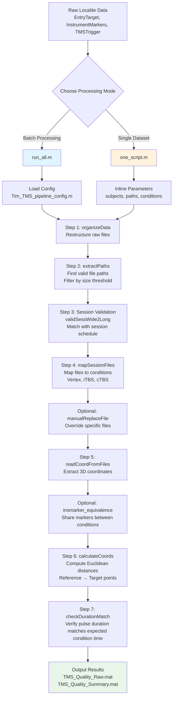

# MATLAB TMS Postprocessing Package

## Description
This MATLAB package processes Localite TMS (Transcranial Magnetic Stimulation) data to calculate Euclidean distances between coil positions and stimulus locations. It extracts coordinates from EntryTarget, InstrumentMarkers, and TMSTrigger files to assess TMS positioning accuracy, data quality, and whether pulse duration matches expected values for each condition.

**Status**: Work in progress - core functionality implemented, non-essential features pending.

## Features
- Processes multiple TMS file types (EntryTarget, InstrumentMarkers, TMSTrigger)
- Calculates Euclidean distances between reference points and TMS trigger locations
- Checks whether pulse duration matches the expected time for each condition (e.g., iTBS ≈ 188 s, cTBS ≈ 40 s)
- Supports multiple experimental conditions (Vertex, iTBS, cTBS)
- Configurable pipeline with CSV-based session validation
- Two execution modes: batch processing and self-contained single .m script

## Installation
Clone the repository:
```bash
git clone https://github.com/yourusername/matlab-tms-postprocessing.git
cd matlab-tms-postprocessing
```

Ensure MATLAB is installed. No additional toolboxes required.

## Quick Start

### Option 1: `run_all.m` (Recommended for Multiple Datasets)
This script uses external configuration files for reproducible batch processing:

1. **Configure your dataset**: Edit `functions/config/Tim_TMS_pipeline_config.m` (or create your own config file)
   - Set subject IDs: `config.subjects = 401:441;`
   - Specify data paths: `config.dirs.raw` and `config.dirs.organized`
   - Configure processing options: `config.run_organizeData`, utility flags

2. **Prepare session validation file**: Place your session list in `functions/config/`
   - Wide format: `Tim_optional_valid_session_list_wide.csv`
   - Or long format: `Tim_valid_session_list_long.csv`

3. **Run the pipeline**:
   ```matlab
   cd script
   run_all
   ```

### Option 2: `one_script.m` (Self-Contained, Easy to Read)
This script contains all parameters and logic in one file - easier to understand but less reproducible:

1. **Edit parameters directly in the script**:
   - Line 8-10: Set `rawDir`, `organizedDir`, `subjects`
   - Line 27: Configure `validTable_wide` file path
   - Line 31-37: Define condition mapping

2. **Run the script**:
   ```matlab
   cd script
   one_script
   ```

## Data Structure
```
data/
├── raw/                    # Raw Localite files
│   └── [dataset_name]/     # e.g., Tim_TMS/
│       └── [subject_folders]/
└── organized/              # Processed file structure
    └── [dataset_name]/
        ├── step_1_all_extracted_path.mat
        ├── step_2_all_valid_files.mat
        ├── step_3_all_files_with_coord.mat
        ├── TMS_Quality_Raw.mat
        └── TMS_Quality_Summary.mat
```

## Processing Workflow



## Key Functions

### Core Processing Functions
- **`organizeData.m`**: Restructures raw Localite files into organized directory
- **`extractPaths.m`**: Scans organized directory and returns file paths meeting size criteria
- **`mapSessionFiles.m`**: Maps extracted files to experimental sessions and conditions
- **`readCoordFromFiles.m`**: Extracts 3D coordinates from Localite files
- **`calculateCoords.m`**: Computes Euclidean distances between reference and target coordinates
- **`checkDurationMatch.m`**: Checks whether pulse durations match expected values for each TMS condition

### Utility Functions
- **`validSessWide2Long.m`**: Converts wide-format session table to long format
- **`manualReplaceFile.m`**: Manually override specific files in the processing pipeline
- **`insmarker_equivalence.m`**: Establishes equivalence between instrument markers across conditions

### Configuration
- **`Tim_TMS_pipeline_config.m`**: Main configuration file defining subjects, paths, and processing options
- **`tms_conditions_config.m`**: Loads experimental conditions and coordinate specifications from CSV files

## Configuration Files

### Pipeline Configuration (`functions/config/Tim_TMS_pipeline_config.m`)
```matlab
config.subjects = 401:441;                    % Subject ID range
config.size_threshold = 100000;            % File size filter (100KB)
config.dirs.raw = 'data/raw/Tim_TMS';         % Raw data directory
config.dirs.organized = 'data/organized/Tim_TMS'; % Output directory
config.run_organizeData = false;              % Skip if already organized
```

### Session Validation Files
- **Wide format**: `Tim_optional_valid_session_list_wide.csv` - One row per subject
- **Long format**: `Tim_valid_session_list_long.csv` - One row per session

### Condition Specifications
- **`Tim_condspec.csv`**: Defines coordinate comparisons (e.g., GreenEntry vs TMSTrigger)

## Output Files
- **`TMS_Quality_Raw.mat`**: Detailed distance calculations for each trigger
- **`TMS_Quality_Summary.mat`**: Aggregated quality metrics per session
- **Intermediate files**: `step_1_*.mat`, `step_2_*.mat`, `step_3_*.mat` for debugging

## Experimental Conditions
- **Vertex**: Control condition with EntryTarget, InstrumentMarkers, and TMSTrigger
- **iTBS**: Intermittent theta burst stimulation with InstrumentMarkers and TMSTrigger (expected duration ≈ 188 s)
- **cTBS**: Continuous theta burst stimulation with InstrumentMarkers and TMSTrigger (expected duration ≈ 40 s)

## Troubleshooting
1. **File size threshold**: Adjust `config.size_threshold` if TMSTrigger files are not detected
2. **Missing coordinates**: Check that Localite files contain valid coordinate data
3. **Session validation**: Ensure session CSV files match your experimental timeline
4. **Path issues**: Use absolute paths or ensure MATLAB working directory is correct
5. **Pulse duration mismatch**: Check checkDurationMatch.m output for flagged sessions, then verify raw TMSTrigger files for accuracy

## Contributing
This package is under active development. Core functionality is stable, but additional features are planned. Contributions welcome!

## License
MIT License - see LICENSE file for details.

## Contact
For questions about this package, please contact Timothy Ng at tinhang.ng@polyu.edu.hk.
